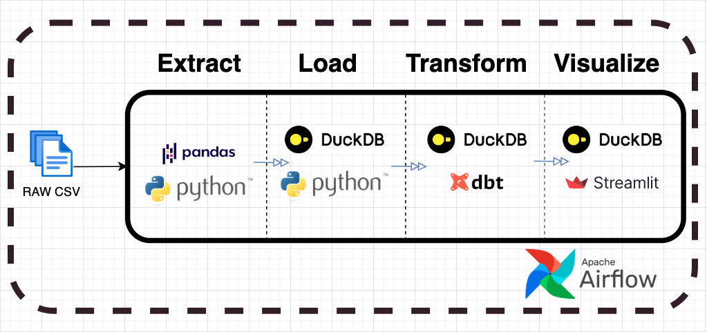
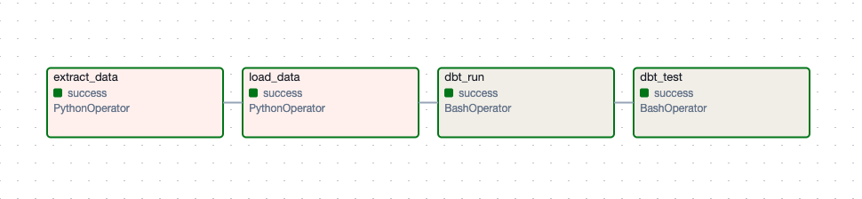
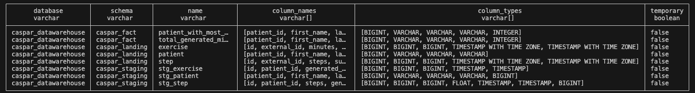
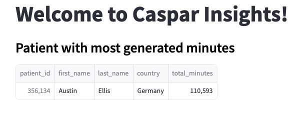

Overview
========

This repository contains an Airflow pipeline following an ELT pattern. The pipeline will ingest caspar health data from a CSV file, push it to a local Duckdb instance, and transform it using dbt to extract valuable insight. Finally, the result is 
shown in a simple Streamlit app 

## End to End Pipeline Infrastructure

This is accomplished by using a set of tools in 4 Airflow DAGs:

- The [Astro Python SDK](https://astro-sdk-python.readthedocs.io/en/stable/index.html) is used for ELT operations.
- [DuckDB](https://duckdb.org/), a relational database, is used to store tables of the ingested data as well as the resulting tables after transformations.
- [DBT](https://docs.getdbt.com/docs/collaborate/documentation), a transformation workflow that allows any business analyst comfortable with SQL to design and implement their own data transformations
- [Streamlit](https://streamlit.io/), a Python package to create interactive apps is used to display the data as a dashboard. The Streamlit app retrieves its data from tables in DuckDB.

## Airflow DAGs

The ready-to-run Airflow pipeline consists of 4 DAGs and will:

- Ingest Caspar activity data from a local CSV file.
- Load the data into the DuckDB instance.
- Run a transformation on the data using the dbt to create a reporting table.
- Display reporting table in a simple Streamlit App

Following is how the DAG executed

## dbt(data build tool)
Dbt uses **caspar_landing** tables as sources and builds the **caspar_staging** and **caspar_fact** tables for calculating the top patient with generated minutes. Additionally, **dbt test** functionality is utilized to check the quality of the created model.

The final schema in the data warehouse looks like this:

## Final Output

After completing all tasks the Streamlit app will look similar to the following screenshots:

## Deploy Your Project Locally
Before running the project, please follow the instructions to install [astro cli](https://docs.astronomer.io/astro/cli/install-cli)

1. Start Airflow on your local machine by running 'astro dev start'. This command will spin up 5 Docker containers on your machine, each for a different Airflow component and one Streamlit component:

- Postgres: Airflow's Metadata Database
- Webserver: The Airflow component responsible for rendering the Airflow UI
- Scheduler: The Airflow component responsible for monitoring and triggering tasks
- Triggerer: The Airflow component responsible for triggering deferred tasks
- Streamlit web app: Streamlit webserver showing reporting table

2. Verify that all 4 Docker containers were created by running 'docker ps'.

3. Access the Airflow UI for your local Airflow project. To do so, please go to http://localhost:8080/ and log in with 'admin' for both your Username and Password. In the UI DAGs panel, run the **caspar_elt_pipeline** to initiate the pipeline.

4. You should also be able to access your Postgres Database at http://localhost:5432/postgres.

5. To access the Streamlit App for displaying of reporting table go to http://localhost:8501/
